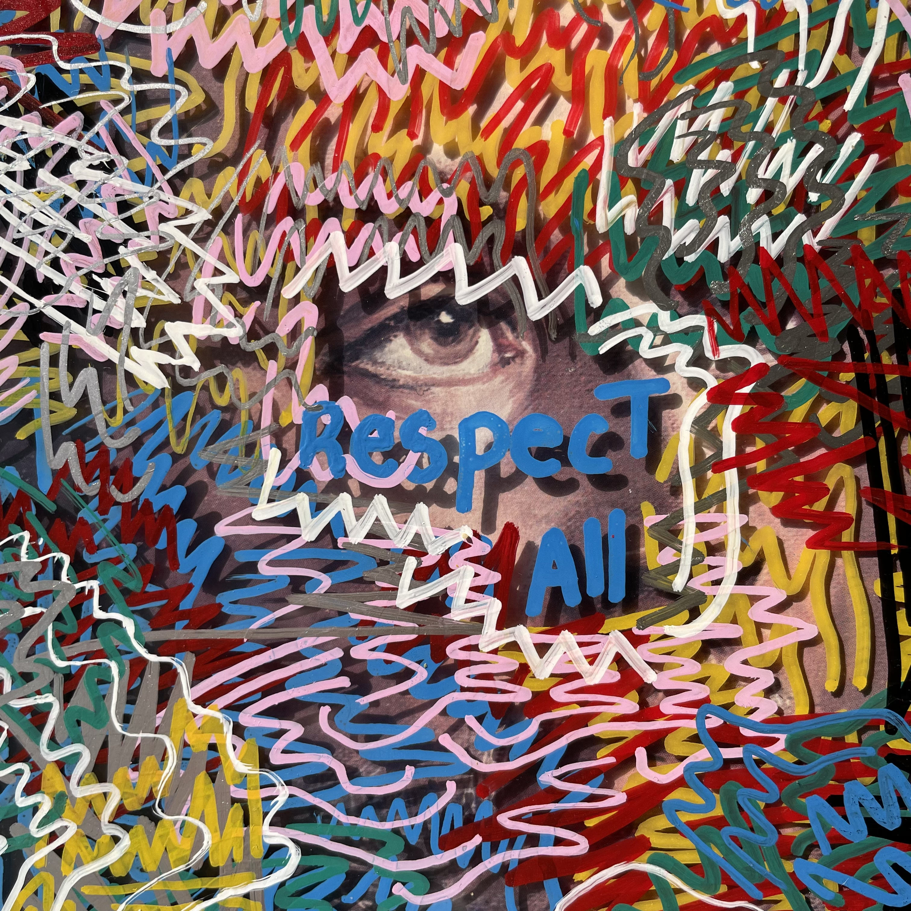
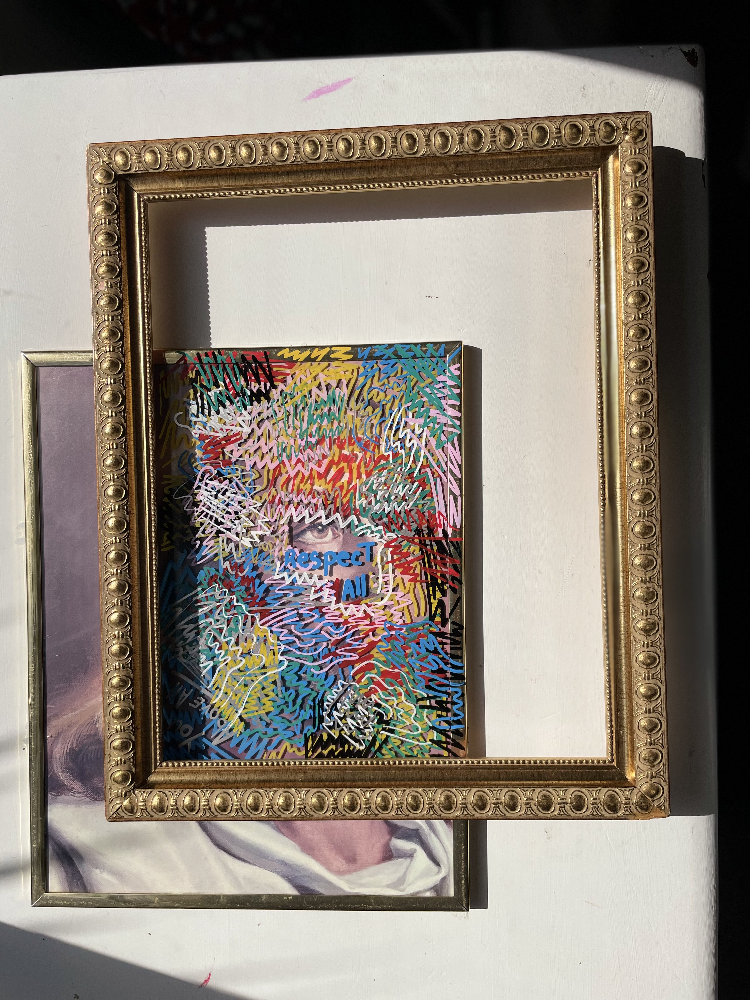
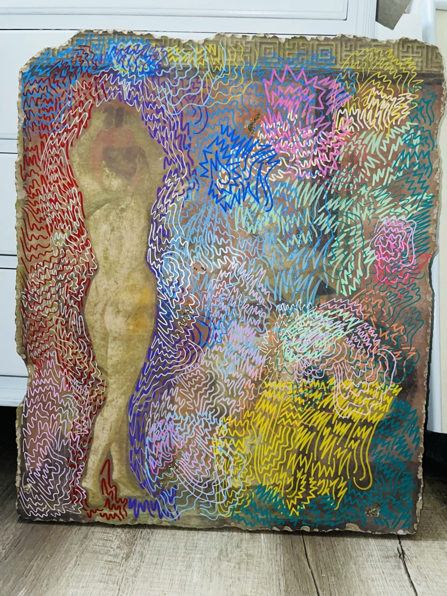
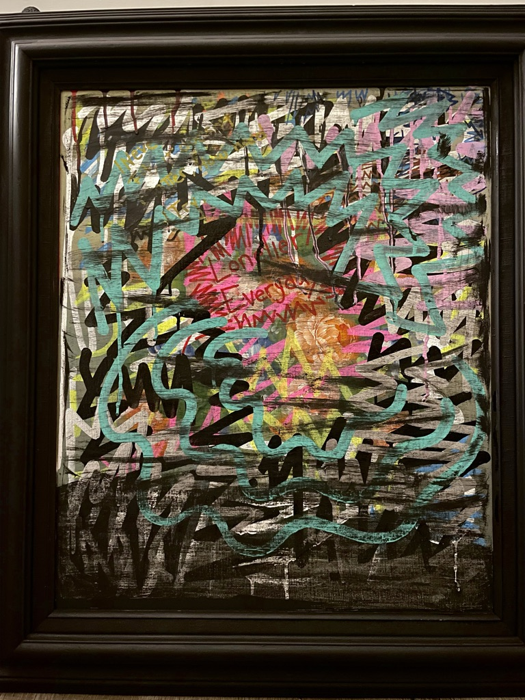
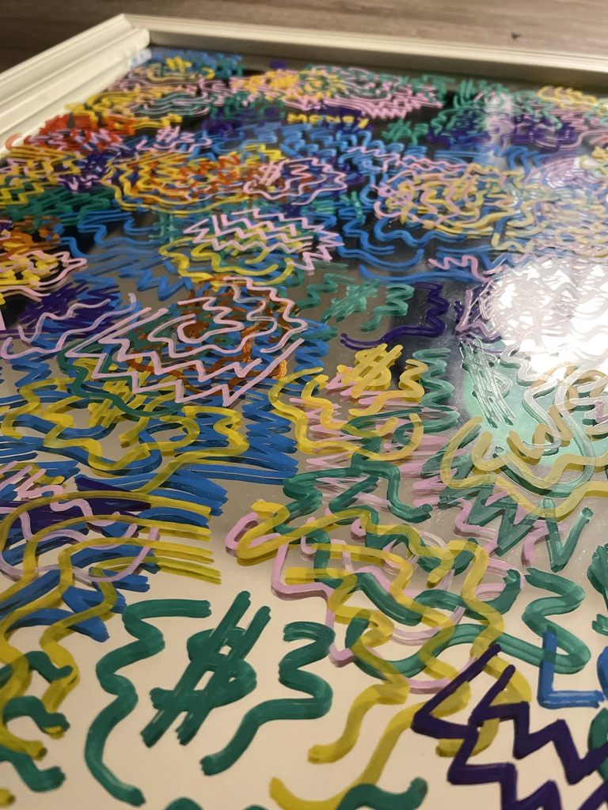

<html lang="en">
<head>
    <meta charset="UTF-8">
    <meta name="Amüre W. Anat" content="Author">
    <meta name="viewport" content="width=device-width, initial-scale=1.0">
    <title>Amüre W. Anat | Author</title>
    <link rel="stylesheet" href="https://cdnjs.cloudflare.com/ajax/libs/font-awesome/6.4.0/css/all.min.css">
    <link rel="stylesheet" href="https://cdnjs.cloudflare.com/ajax/libs/aos/2.3.4/aos.css">
    
</head>
<body>
    <header id="header">
        <a href="#" class="logo">Amüre W. Anat</a>
        <button class="mobile-toggle" id="mobileToggle">
            <i class="fas fa-bars"></i>
        </button>
        <nav class="nav-links" id="navLinks">
            <a href="#home">Home</a>
            <a href="#bio">Bio</a>
            <a href="#book">Projects</a>
            <a href="#contact">Contact</a>
        </nav>
    </header>

    <section id="home" class="hero">
        

            

             <h1 class="hero-title">Dear,</h1>
                

                    

                        Here we are. You and me on a digital layer. Face to face, in different times, in different places.   
                        Check my debut novel, read it through, pay attention, drop the book and forget you even read it. Because nothing is too serious, but the tyranny of the rich, and drudgery of the dull.
                    

                

            

            

                
                <!-- Removed overlay div -->
            

        

    </section>

    <section id="bio" class="section">
        

            

                
                <!-- Removed overlay div -->
            

            

                <h2 class="section-title">Bio</h2>
                

                    1996 - Forever and Never  
                    Born and exist. I love life even though I tried to end it. I've moved in different levels of consciousness many times, up, down, up, down, and always kept flowing to the next one. Life is black and white, grey and colorful. Bright and beautiful, dark and twisted.  
                    I was born in Venezuela, and lived most of my life in a tiny island of the Caribbean. Also lived in Argentina, America, and I'm currently living in Spain.
                

            

        

    </section>

    <section id="book" class="section book-section">
        

            

                <h2 class="section-title">Projects</h2>
                <h3 class="book-title">Dear God, King David is Dead</h3>
                    It is a contemporary coming-of-age story about the highs of reinvention and the inevitable pull of self-destruction.

                      

                    A boy escapes his past by reinventing himself in Miami's nightlife, but as friendships fade and love slips through his fingers, he realizes that no matter how far he runs, he can't escape himself.

                      

                    Through a deeply introspective and emotionally charged narrative, it explores identity, loneliness, and the fleeting nature of joy, while subtly engaging with themes of anti-capitalism and distrust in authority. 

                      

                    It's wild, fun and emotional.
            

            

    
    
William Merritt Chase (painter) American, 1849 - 1916

<!-- This should be placed inside the existing book-section, after the Dear God project content -->

    <h3 class="gallery-title">Paintings</h3>
    

        

            

                
                
                

                    
Respect All

                    
2021

                

            

        

        

            

                
                

                    
Sin Ti

                    
2021

                

            

        

    

    

        

            

                
                

                    
Lonelier Everyday

                    
2022

                

            

        

        

            

                
                

                    
Untitled

                    
2022

                

            

        

    

        

    </section>

    <section id="contact" class="contact-section">
        <h2 class="section-title" data-aos="fade-up">Contact Information</h2>
        

            
<i class="fas fa-phone"></i> +34 645-076-253

            
<i class="fas fa-envelope"></i> <a href="mailto:Aishtapamura@gmail.com" style="color: var(--primary); text-decoration: none;">Aishtapamura@gmail.com</a>

        

        

            <a href="https://www.instagram.com/renesotillo/" target="_blank" class="social-link">
                <i class="fab fa-instagram"></i>
            </a>
            <a href="https://www.linkedin.com/in/amurewanat/" target="_blank" class="social-link">
                <i class="fab fa-linkedin-in"></i>
            </a>
        

    </section>

    <footer>
        
&copy; 2025 Amüre W. Anat. All rights reserved.

    </footer>

    <a href="#" class="back-to-top" id="backToTop">
        <i class="fas fa-arrow-up"></i>
    </a>

    
    
</body>
</html>
